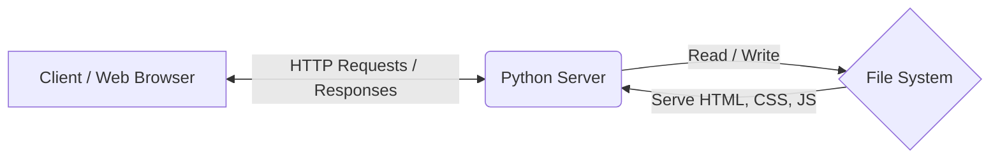

<div align="center">

# LEARN PYTHON SERVER SM

[](https://www.python.org/)
[](https://developer.mozilla.org/en-US/docs/Web/JavaScript)
[](https://developer.mozilla.org/en-US/docs/Web/HTML)
[](https://developer.mozilla.org/en-US/docs/Web/CSS)

> _"This is a remake - Minimalist, robust, and highly optimized."_

A personal learning project dedicated to building a foundational web server. It seamlessly integrates a Python backend with a dynamic frontend to demonstrate how web requests and responses work under the hood.

</div>

---

## Architecture Flow

Here is a simplified view of how the system operates:



## Tech Stack

| Technology                                                                                                                                | Role in Project   | Percentage |
| :---------------------------------------------------------------------------------------------------------------------------------------- | :---------------- | :--------- |
|  **HTML5**                | Web Structure     | 38.2%      |
|  **JavaScript** | Client-side Logic | 28.5%      |
|  **Python**             | Server & Backend  | 17.9%      |
|  **CSS3**                   | Styling & UI      | 15.4%      |

## Project Details

<details>
<summary><b>Click to expand: Folder Structure</b></summary>
<br>

```text
learnpythonserver-sm/
│
├── server.py          # The main Python server script
├── index.html         # Main entry point for the frontend
├── style.css          # Stylesheets
├── script.js          # Frontend interactions
└── README.md          # Project documentation
```

</details>

<details>
<summary><b>Click to expand: Roadmap / To-Do</b></summary>
<br>

- [ ] Complete robust API endpoints for JS-Python communication.
- [ ] Improve CSS for better mobile responsiveness.
- [ ] Connect a lightweight database (e.g., SQLite).
</details>

## Getting Started (Ubuntu Linux)

Run these commands in your Ubuntu terminal:

```bash
# 1. Clone the repository
git clone https://github.com/gemini-dot/learnpythonserver-sm.git
cd learnpythonserver-sm

# 2. Run the server (Ensure Python 3 is installed)
python3 server.py
# (Or use: python3 -m http.server 8000)

# 3. Access the web app
# Open your browser and go to http://localhost:8000
```

## Star History

[](https://star-history.com/#gemini-dot/learnpythonserver-sm&Date)

---

_Created by [@gemini-dot](https://github.com/gemini-dot)_
