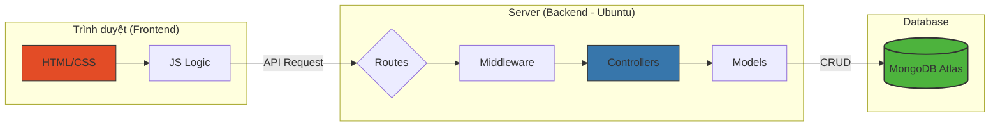

```mermaid
graph LR
subgraph "Trình duyệt (Frontend)"
A[HTML/CSS] --> B[JS Logic]
end

    subgraph "Server (Backend - Ubuntu)"
    B -- "API Request" --> C{Routes}
    C --> D[Middleware]
    D --> E[Controllers]
    E --> F[Models]
    end

    subgraph "Database"
    F -- "CRUD" --> G[(MongoDB Atlas)]
    end

    style G fill:#4DB33D,stroke:#333,stroke-width:2px
    style A fill:#e34c26,stroke:#333
    style E fill:#3776ab,stroke:#333
```
